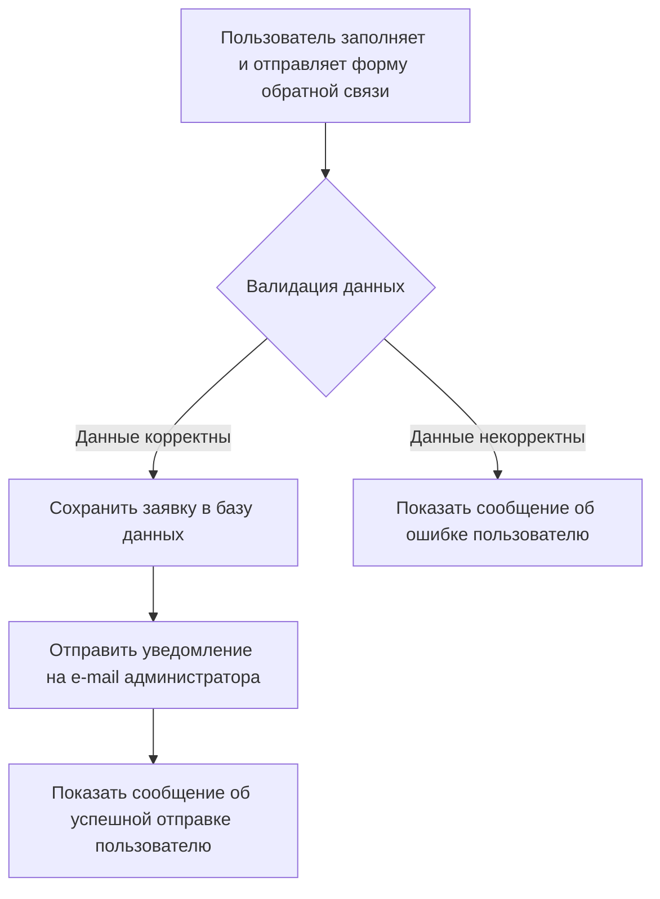

```mermaid
flowchart TD
    A[Пользователь заполняет и отправляет форму обратной связи] --> B{Валидация данных}
    B -- Данные корректны --> C[Сохранить заявку в базу данных]
    C --> D[Отправить уведомление на e-mail администратора]
    D --> E[Показать сообщение об успешной отправке пользователю]
    B -- Данные некорректны --> F[Показать сообщение об ошибке пользователю]
```